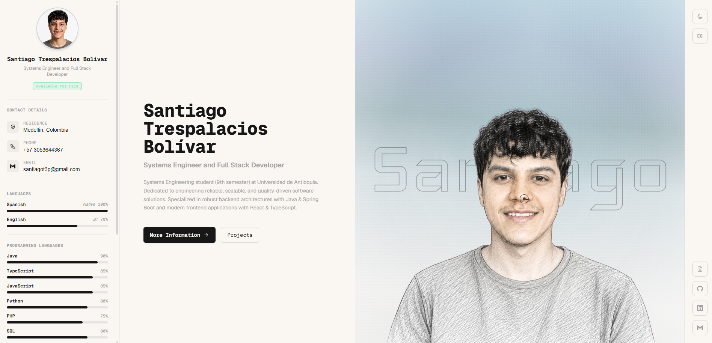
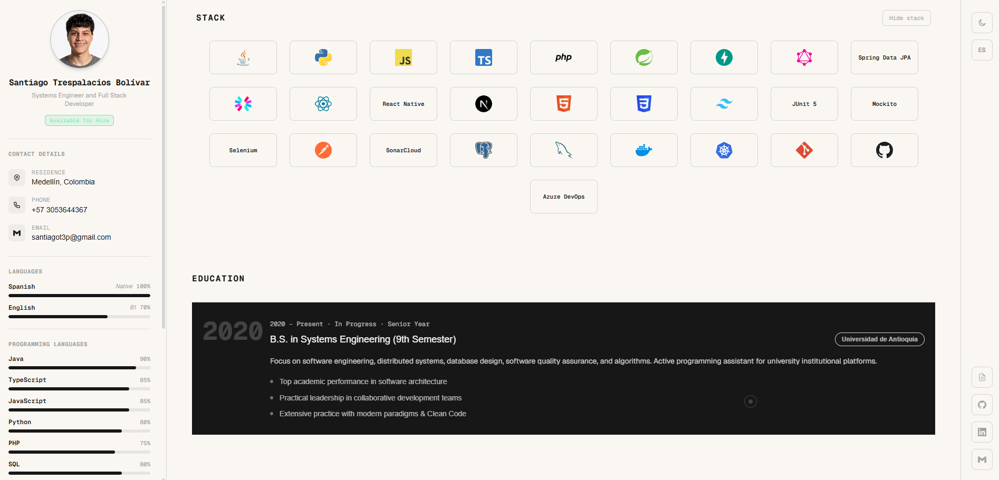
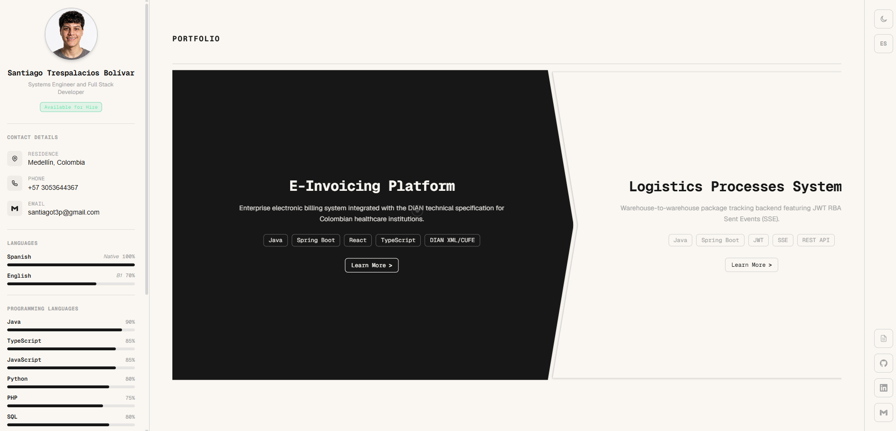
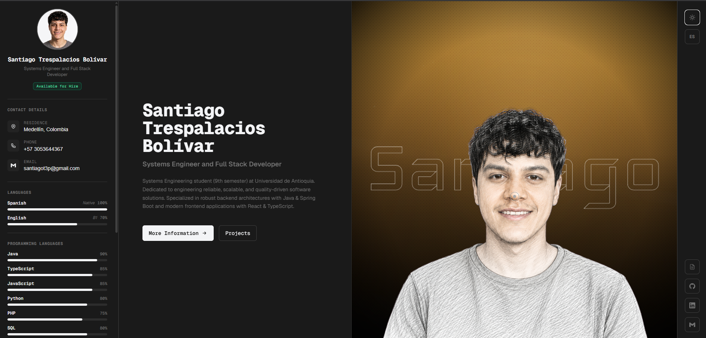
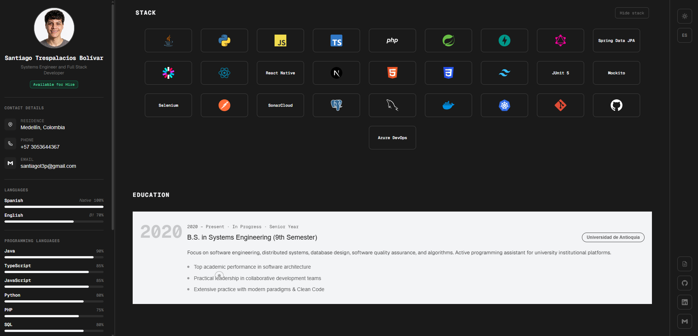
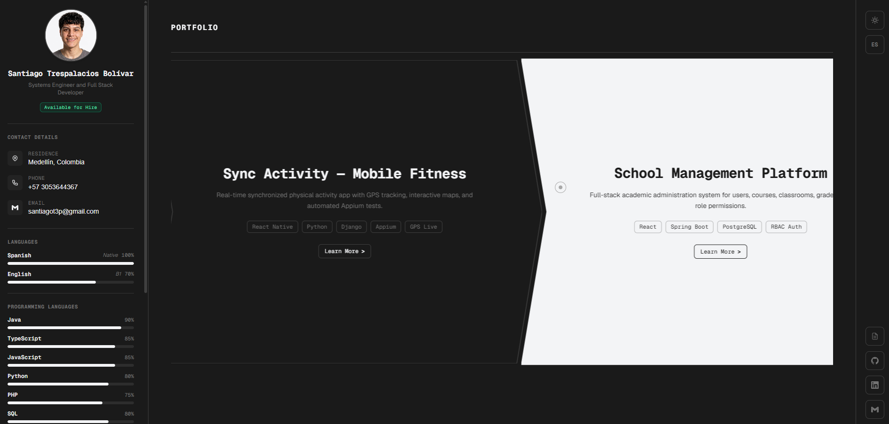
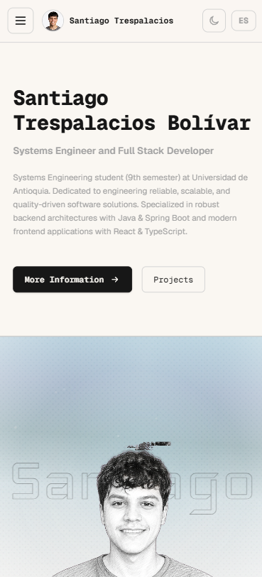
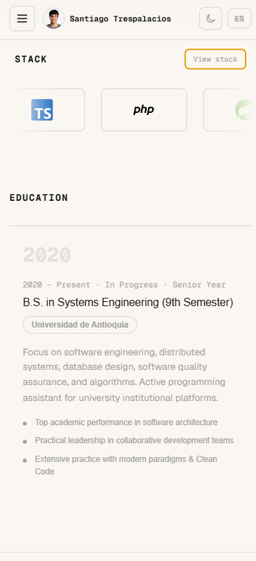
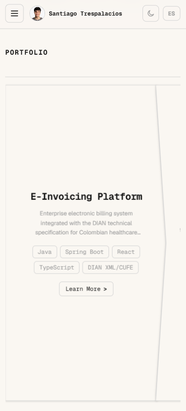

# Portafolio Profesional — Proyecto Evaluativo 1 (25%)
## Ingeniería Web · Universidad de Antioquia
**Estudiante:** Santiago Trespalacios Bolívar  
**Profesor:** Juan Pablo Arango  
**Fecha de Entrega:** 27 de Septiembre de 2026  

---

## 1. Propósito del Proyecto

El objetivo de este proyecto es interiorizar el proceso de desarrollo frontend moderno utilizando **Next.js**, **React**, **TypeScript** y **Tailwind CSS**, partiendo de la maqueta y especificaciones de un diseño en **Figma** (estructura de 3 columnas: Menú Izquierdo Fijo, Contenido Central scrolleable y Menú Derecho Fijo).

La aplicación preserva una identidad visual de ingeniería de software (paleta en tonos cálidos/oscuros, tipografías monoespaciadas y de display *Iceland*, microinteracciones y animaciones fluidas), implementando una arquitectura estricta basada en **Atomic Design**, soporte bilingüe (Español / Inglés), cambio de tema (Claro / Oscuro) y un innovador **carrusel horizontal fijado al scroll vertical (Sticky Pinned Scroll)**.

---

## 2. Enlace de Despliegue en Vercel

- **URL de Producción:** [https://santiago-trespalacios.vercel.app](https://santiago-trespalacios.vercel.app)
- **Repositorio de GitHub:** [https://github.com/202602-Ingeniria-Web-Udea/santiago-trespalacios-bolivar-portafolio](https://github.com/202602-Ingeniria-Web-Udea/santiago-trespalacios-bolivar-portafolio)

---

## 3. Tecnologías y Herramientas

- **Framework:** [Next.js 16](https://nextjs.org/) (App Router & Turbopack)
- **Biblioteca UI:** [React 19](https://react.dev/)
- **Lenguaje:** [TypeScript 5](https://www.typescriptlang.org/)
- **Estilos:** [Tailwind CSS v4](https://tailwindcss.com/)
- **Tipografías:** `Geist Sans`, `Geist Mono` y `Iceland` (Google Fonts optimizadas vía `next/font`)
- **Íconos:** SVGs optimizados implementados directamente según la metodología vista en clase
- **Gestor de Paquetes:** Bun / npm

---

## 4. Arquitectura y Metodología Atomic Design

El proyecto está organizado rigurosamente bajo la metodología de **Atomic Design** en `src/components/`:

```
src/
├── app/                      # Rutas, layout raíz, providers y estilos globales
├── components/
│   ├── atoms/                # Componentes fundamentales e indivisibles
│   │   ├── ProgressBar.tsx
│   │   ├── Badge.tsx
│   │   ├── Button.tsx
│   │   ├── SocialIconButton.tsx
│   │   ├── SectionHeading.tsx
│   │   ├── Modal.tsx
│   │   └── IconWrapper.tsx
│   ├── molecules/            # Combinación de átomos con propósito específico
│   │   ├── SkillBar.tsx
│   │   ├── ContactItem.tsx
│   │   ├── KnowledgeCard.tsx
│   │   ├── EducationCard.tsx
│   │   ├── ProjectCard.tsx
│   │   └── ModalDialog.tsx
│   ├── organisms/            # Secciones completas compuestas por moléculas y átomos
│   │   ├── LeftSidebar.tsx
│   │   ├── RightSidebar.tsx
│   │   ├── ProfileSection.tsx
│   │   ├── KnowledgeSection.tsx
│   │   ├── EducationSection.tsx
│   │   ├── PortfolioSection.tsx
│   │   ├── CreativeProfileModal.tsx
│   │   ├── ProjectDetailModal.tsx
│   │   ├── MobileHeader.tsx
│   │   └── Footer.tsx
│   └── templates/            # Plantilla de layout de 3 columnas
│       └── PortfolioLayout.tsx
└── constants/                # Constantes y datos fuertemente tipados
    ├── portfolioData.ts
    ├── translations.ts
    └── site.ts
```

### Evidencia de Reutilización de Componentes (Rúbrica: Mínimo 6 en > 2 partes)

| Componente | Nivel Atómico | Dónde se reutiliza en el código |
| :--- | :--- | :--- |
| **`ProgressBar`** | Átomo | 1. Idiomas en `LeftSidebar`<br>2. Lenguajes de Programación en `LeftSidebar`<br>3. Molécula `SkillBar` |
| **`Badge`** | Átomo | 1. Habilidades extra en `LeftSidebar`<br>2. Tags de tecnologías en `KnowledgeCard`<br>3. Fechas y estado en `EducationCard`<br>4. Tecnologías en `ProjectCard`<br>5. Tags en modales `CreativeProfileModal` y `ProjectDetailModal` |
| **`Button`** | Átomo | 1. Botón de llamada a la acción en `ProfileSection`<br>2. Botón "Saber más" en `ProjectCard`<br>3. Botón de Descarga de CV en `LeftSidebar`<br>4. Botones de acción y enlaces a repositorios en `ProjectDetailModal` y `ModalDialog` |
| **`SocialIconButton`** | Átomo | 1. Menú lateral derecho fijo (`RightSidebar`)<br>2. Datos de contacto en `LeftSidebar`<br>3. Enlaces del pie de página en `Footer`<br>4. Enlaces externos en diálogos modales |
| **`SectionHeading`** | Átomo | 1. Encabezado de `ProfileSection`<br>2. Encabezado de `KnowledgeSection`<br>3. Encabezado de `EducationSection`<br>4. Encabezado de `PortfolioSection` |
| **`Modal`** | Átomo | 1. Diálogo creativo e interactivo de perfil (`CreativeProfileModal`)<br>2. Diálogo de información detallada de proyectos (`ProjectDetailModal`)<br>3. Molécula base `ModalDialog` |
| **`IconWrapper`** | Átomo | 1. Tarjetas de conocimientos (`KnowledgeCard`)<br>2. Tarjetas de educación (`EducationCard`)<br>3. Filas de información de contacto (`ContactItem`) |

---

## 5. Cumplimiento de Secciones (Diseño Figma)

### 1. Menú Izquierdo (Fijo) — `LeftSidebar.tsx`
- **Información Personal:** Foto de perfil del estudiante, nombre completo (*Santiago Trespalacios Bolívar*) y título profesional (*Estudiante de Ingeniería de Sistemas / Full Stack Developer*).
- **Datos de Contacto:** Ciudad de residencia (Medellín, Colombia), teléfono con enlace directo, correo electrónico con enlace `mailto` y disponibilidad laboral actual.
- **Idiomas:** Listado con barras de progreso y porcentaje de dominio (Español 100% Nativo, Inglés 80% B2 Profesional).
- **Lenguajes de Programación:** Listado con barras de progreso porcentuales (Java 90%, TypeScript 85%, JavaScript 85%, Python 80%, PHP 75%, SQL 80%).
- **Habilidades Extra:** Etiquetas (*Badges*) con competencias duras y blandas (Git, Scrum, Arquitectura Limpia, Pruebas Unitarias con JUnit/Mockito, APIs RESTful, Docker, etc.).
- **Descarga de Hoja de Vida:** Botón estilizado para descargar el archivo PDF del CV directamente.

### 2. Contenido Central (Scroll Vertical)
- **Perfil (`ProfileSection.tsx`):**
  - Nombre del estudiante y titular profesional.
  - **Foto en fondo blanco:** Marco estilizado con fondo blanco puro según la especificación de Figma.
  - Descripción corta de perfil profesional orientada al desarrollo backend y frontend.
  - **Botón con Diálogo Creativo:** Abre el componente `CreativeProfileModal.tsx`, un *Dossier de Ingeniería* con emulador interactivo de terminal CLI (`whoami`, `skills`, `projects`, `contact`, `clear`), métricas y principios de arquitectura.
- **Conocimientos (`KnowledgeSection.tsx`):**
  - Cuadrícula de tarjetas con íconos SVG vectoriales, títulos y descripciones técnicas detalladas:
    - *Desarrollo Backend* (Java, Spring Boot, REST APIs).
    - *Desarrollo Frontend* (React, Next.js, TypeScript, Tailwind).
    - *Control de Calidad (QA) & Testing* (JUnit 5, Mockito, Selenium, Appium, SonarCloud).
    - *Bases de Datos & Persistencia* (PostgreSQL, MySQL, Spring Data JPA).
    - *DevOps & CI/CD* (Docker, Kubernetes, Git, GitHub).
    - *Desarrollo Móvil* (React Native, Android, GPS Live).
  - Incluye además el visualizador interactivo *TechShowcase* de tecnologías.
- **Educación (`EducationSection.tsx`):**
  - Tarjetas de formación académica según Figma:
    - *Universidad de Antioquia* — Ingeniería de Sistemas (9º Semestre, 2020 – Presente).
    - *Formación Técnica Continua* — Desarrollo Full Stack y Pruebas Automatizadas (2023 – 2026).
- **Portafolio (`PortfolioSection.tsx`):**
  - **Carrusel horizontal accionado por scroll vertical (Pinned Sticky Horizontal Scroll):** Al desplazarse hacia abajo, la vista se fija suavemente (`sticky`) y el usuario navega horizontalmente a través de los proyectos a medida que continúa scrolleando. Al llegar al último proyecto, la pantalla se libera automáticamente para continuar bajando hacia el pie de página.
  - Cuatro proyectos empresariales y académicos reales con ilustraciones SVG dedicadas:
    1. *Plataforma de Facturación Electrónica* (Java, Spring Boot, React, DIAN).
    2. *Logistics Processes System API* (Spring Boot, JWT, SSE).
    3. *Sync Activity — Fitness Móvil* (React Native, Python, Django, Appium).
    4. *School Management Platform* (React, Spring Boot, PostgreSQL, RBAC).
  - Cada card cuenta con el botón **"Saber más"** que despliega el modal `ProjectDetailModal.tsx` con arquitectura, aportes clave y enlaces a repositorios de GitHub.
- **Footer (`Footer.tsx`):**
  - Diseño libre y elegante con la tipografía monumental *SANTIAGO*, información de derechos de autor y enlaces directos.

### 3. Menú Derecho (Fijo) — `RightSidebar.tsx`
- Barra fija vertical con íconos vectoriales y *tooltips* interactivos:
  - Enlace al perfil de **GitHub** (Obligatorio).
  - Enlace al perfil de **LinkedIn** (Obligatorio).
  - Enlace directo a **Correo Electrónico**.
  - **Selector de Tema:** Alterna dinámicamente entre modo Claro y Oscuro.
  - **Selector de Idioma:** Alterna entre Español e Inglés con reactividad global.

---

## 6. Responsividad y Adaptabilidad

- **Desktop (≥ 1024px):** Layout de 3 columnas fijas/sticky con proporciones optimizadas para pantallas estándar y ultrapanorámicas.
- **Móvil y Tablet (< 1024px):**
  - Incorpora `MobileHeader.tsx` con acceso rápido a tema, idioma y botón tipo hamburguesa que despliega un cajón lateral (*drawer*) suave para consultar el menú izquierdo sin invadir el espacio de lectura.
  - El carrusel de proyectos y los diálogos modales se adaptan fluidamente a pantallas táctiles.

---

## 7. Ejecución Local

### Prerrequisitos
- Node.js versión 20 o superior (o [Bun](https://bun.sh/))

### Pasos de Instalación y Ejecución

1. **Clonar el repositorio:**
   ```bash
   git clone https://github.com/S4NT14G0V/s4nt14g0v.github.io.git
   cd s4nt14g0v.github.io
   ```

2. **Instalar dependencias:**
   ```bash
   bun install
   # o con npm:
   npm install
   ```

3. **Ejecutar el servidor de desarrollo:**
   ```bash
   bun dev
   # o con npm:
   npm run dev
   ```

4. **Abrir en el navegador:**
   Visita [http://localhost:3000](http://localhost:3000).

5. **Construir para producción (Build):**
   ```bash
   bun run build
   # o con npm:
   npm run build
   ```

---

## 8. Criterios de Calificación Atendidos

- **Funcionalidad (40%):** 
  - Todo el flujo opera de forma óptima sin errores de consola ni advertencias.
  - Cumplimiento de más de 6 componentes reutilizables con Atomic Design en más de 2 partes del código.
  - Estilos construidos con utilidades nativas de Tailwind CSS.
  - Listo para despliegue en Vercel.
- **Estructura del Código y Claridad (20%):**
  - Organización modular en `atoms`, `molecules`, `organisms` y `templates`.
  - Nomenclatura coherente en TypeScript con interfaces explícitas.
  - Comentarios explicativos en todos los componentes.
- **Diseño e Interfaz de Usuario (20%):**
  - Maquetación fiel a los requerimientos de la plantilla de Figma adaptada al estilo personal del estudiante.
  - Responsividad completa testeada en móviles, tablets y monitores de escritorio.
  - Revisión exhaustiva de ortografía y gramática en español e inglés.
- **Innovación y Creatividad (10%):**
  - Carrusel horizontal accionado por scroll vertical (Sticky Pinned Scroll).
  - Diálogo creativo en Perfil con terminal CLI interactiva funcional y métricas.
  - Modales enriquecidos con arquitectura de proyectos.
- **Documentación (10%):**
  - `README.md` exhaustivo y comentarios descriptivos en el código fuente.

## 9. Evidencias

A continuación se presentan las capturas de pantalla que evidencian la implementación, diseño, responsividad y temas de la aplicación:

### Modo Claro (Light Mode)

| Vista Principal (Hero / Perfil) | Stack Tecnológico & Educación | Proyectos / Portafolio |
| :---: | :---: | :---: |
|  |  |  |

---

### Modo Oscuro (Dark Mode)

| Vista Principal (Hero / Perfil) | Stack Tecnológico & Educación | Proyectos / Portafolio |
| :---: | :---: | :---: |
|  |  |  |

---

### Vista Móvil (Mobile View)

| Vista Principal Móvil | Stack & Educación Móvil | Proyectos Móvil |
| :---: | :---: | :---: |
|  |  |  |
